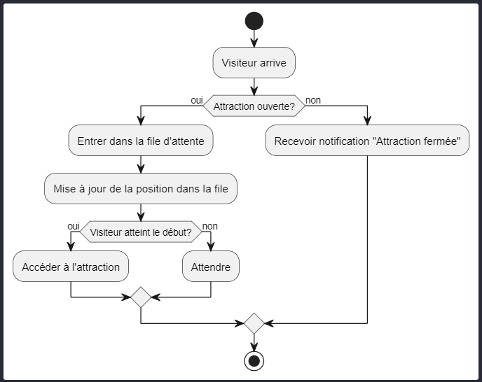
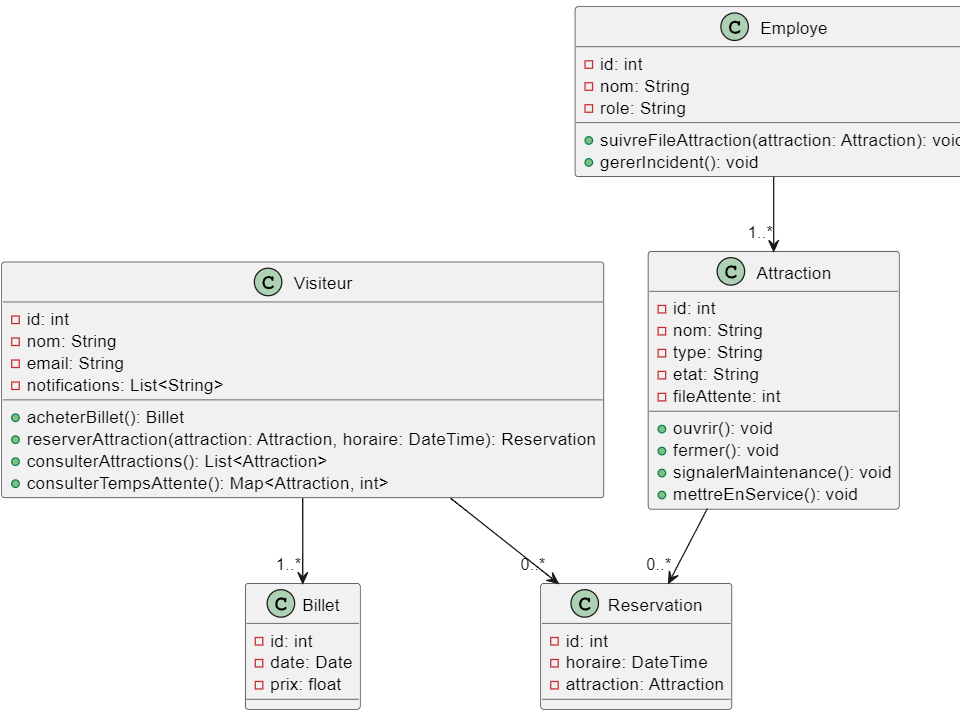

# 🎢 Projet UML Virtual Amusement Park

Ce projet modélise un système de gestion pour un parc d'attractions virtuel en utilisant UML. Il vise à faciliter la planification et l'organisation des activités pour les visiteurs et les employés, tout en respectant les bonnes pratiques de modélisation.

Projet réalisé par <a href="https://github.com/florentbaccard" target="_blank">Florent BACCARD</a>, <a href="https://github.com/Chr1stopherPerez" target="_blank">Christopher PEREZ</a> & <a href="https://github.com/tojo2803" target="_blank">Tojoniaina Mbolasafi RATSIMBAZAFY</a>, demandé au sein de notre formation proposée par [EPSI](https://www.epsi.fr/).

## Fonctionnalités principales

- **Visiteurs** :
  - Planification de visites.
  - Achat de billets.
  - Réservation de créneaux horaires pour les attractions.
  - Consultation des temps d'attente, restaurants, et boutiques.
- **Gestion interne** :

  - Suivi des files d'attente.
  - Maintenance des attractions.
  - Gestion des employés.

## Structure du projet

```
B3_Projet_UML/
├── diagrams/             # Diagrammes UML au format PlantUML
│   ├── Activity_Diagram_Queue.plantuml
│   ├── Class_Diagram.plantuml
│   ├── Enhanced_Use_Case_Diagram.plantuml
│   ├── Sequence_Diagram_Reservation.plantuml
│   └── State_Diagram_Attraction_bad.plantuml
├── documents/            # Exigeances du projet
│   └── Projet-UML.pdf
├── Capture1.png          # Images du projet
├── Capture2.png
└── readme.md             # Fichier de présentation
```

## Diagrammes inclus

1. **Diagramme d'activité** : Gestion des files d'attente.
2. **Diagramme de classes** : Relations entre les entités principales du système.
3. **Diagramme de cas d'utilisation** : Interactions entre les acteurs et le système.
4. **Diagramme de séquence** : Réservation d'une attraction.
5. **Diagramme d'états** : Cycle de vie des attractions.

## Virtualisation des Diagrammes

1. **Installation des Dépendances** :

```bash
Installez l'extension PlantUML
```

```bash
Téléchargez Graphviz
```

2. **Ouverture et Visualisation** :

-Chargez un fichier .plantuml dans VS Code. <br>
-Appuyez sur Alt+D pour afficher le diagramme.

---

## Captures d'Écran



